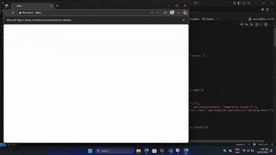

# Five Boroughs Libraries

## Web Scraping Location and Hours from NY Libraries (NY, Brooklyn and Queens)
In this repository you can learn how to web scrape data from public web sites and store them on your favorite database system.

    

## 📚 Resources #Learning #References
- [BeautifulSoup Documentation](https://www.crummy.com/software/BeautifulSoup/bs4/doc/)
- [Selenium Documentation](https://www.selenium.dev/documentation/)

## 🙌 Contributing #OpenSource #Collaboration
Contributions are welcome! Please open issues or pull requests.

---

_Last updated: November 12, 2025_